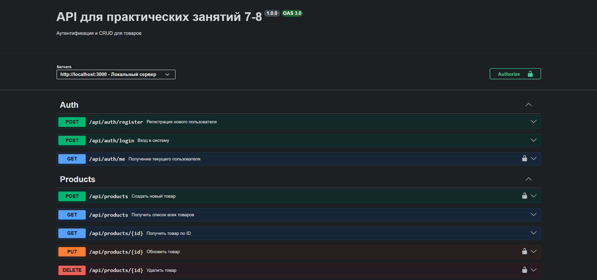
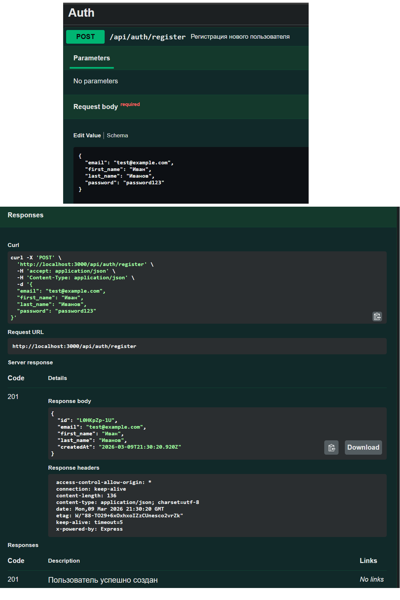

# Практические занятия 7-8: Аутентификация и JWT

## Описание проекта
Node.js приложение с аутентификацией (регистрация, вход, JWT токены) и CRUD операциями для товаров.

## Функциональность

### Практическое занятие 7
- Регистрация пользователя (POST /api/auth/register)
  - Хеширование паролей с bcrypt
  - Валидация email и пароля
- Вход в систему (POST /api/auth/login)
  - Проверка учетных данных
  - Возврат данных пользователя

### Практическое занятие 8
- JWT аутентификация
- Защищенный маршрут GET /api/auth/me (требуется токен)
- CRUD для товаров:
  - POST /api/products - создание товара (требуется токен)
  - GET /api/products - список всех товаров
  - GET /api/products/:id - товар по ID
  - PUT /api/products/:id - обновление товара (требуется токен)
  - DELETE /api/products/:id - удаление товара (требуется токен)

## Установка и запуск

```bash
# Клонировать репозиторий
git clone <your-repo-url>
cd nodejs-auth-crud

# Установить зависимости
npm install

# Запустить в режиме разработки
npm run dev

# Запустить в production режиме
npm start


## Скриншоты

### Swagger UI


### Регистрация пользователя


### Вход в систему (получение токена)
.png)

### Защищенный маршрут /me


### Создание товара
